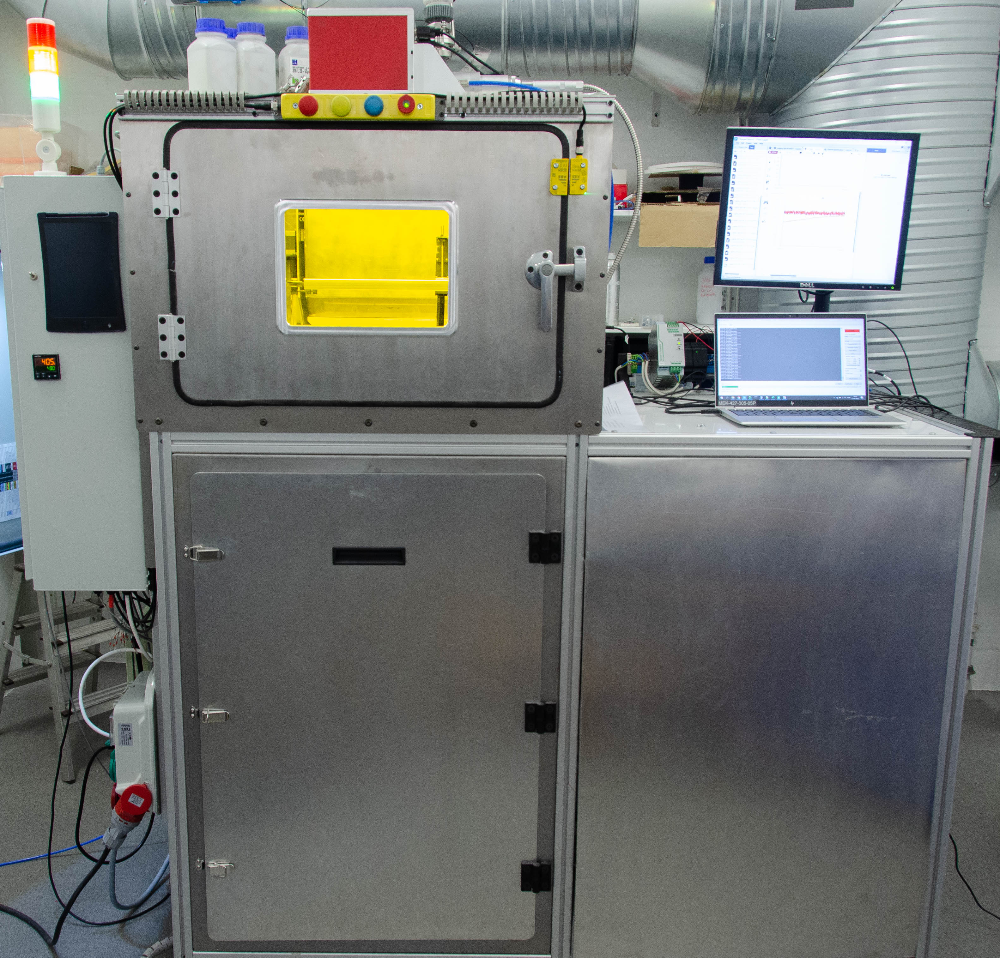
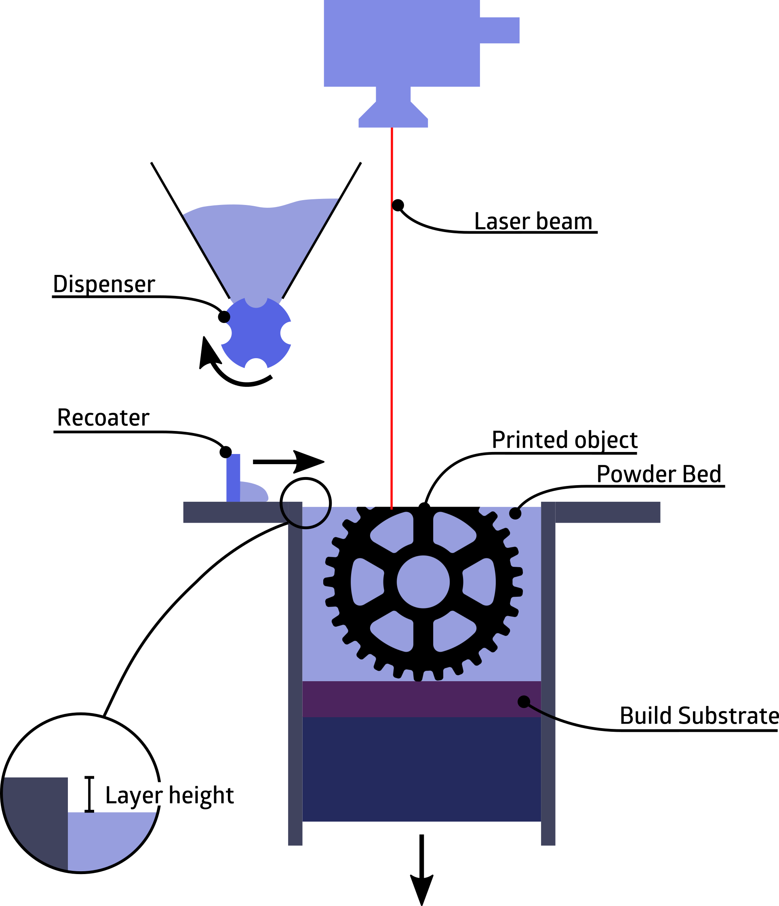
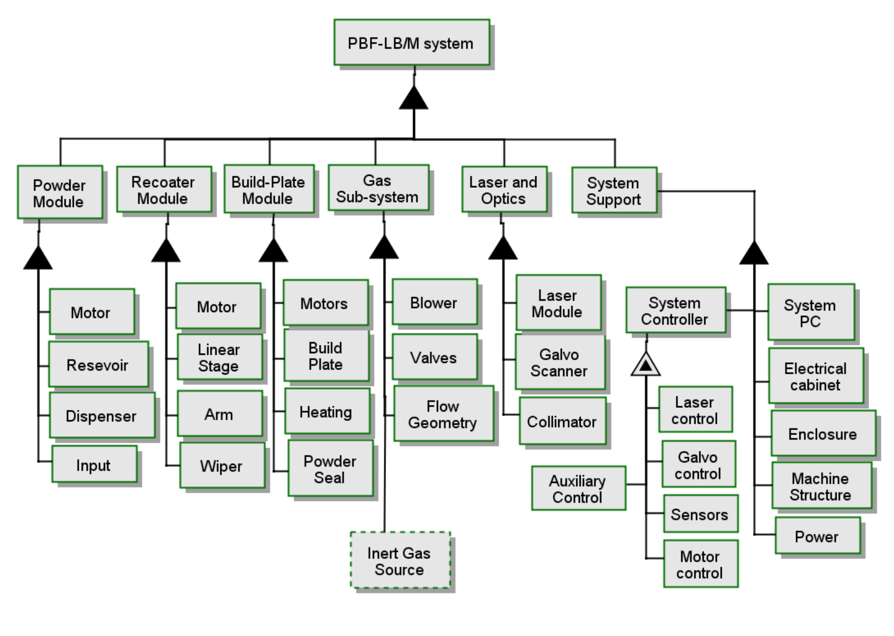
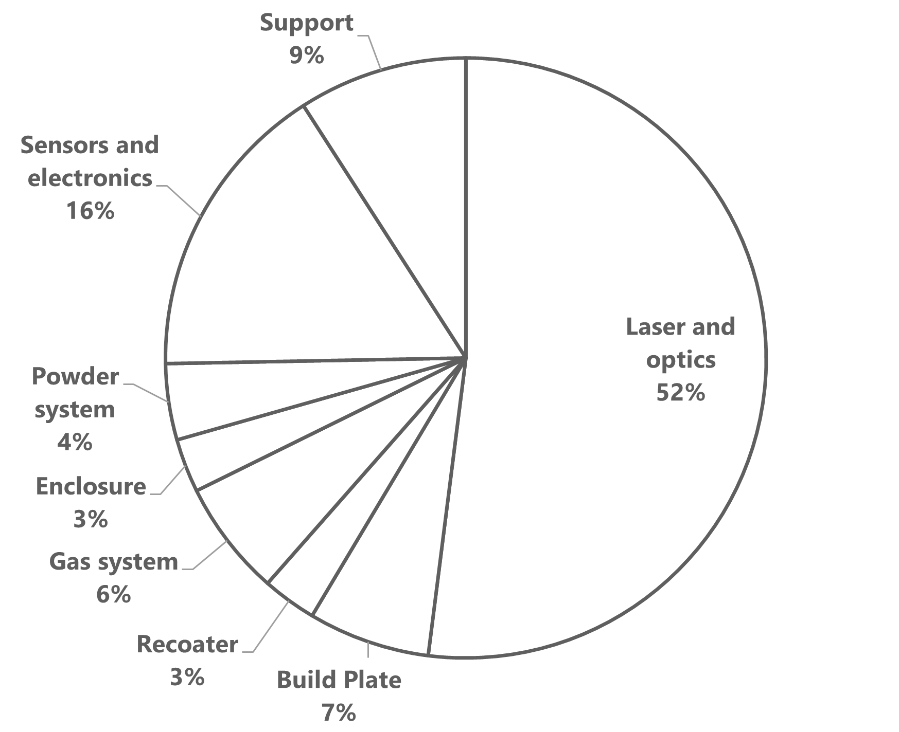
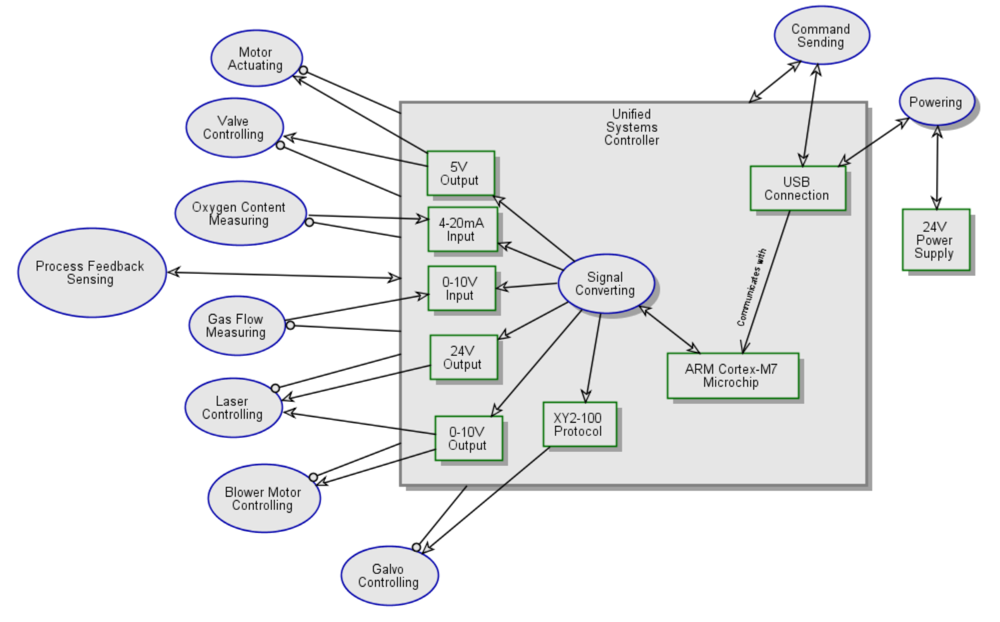
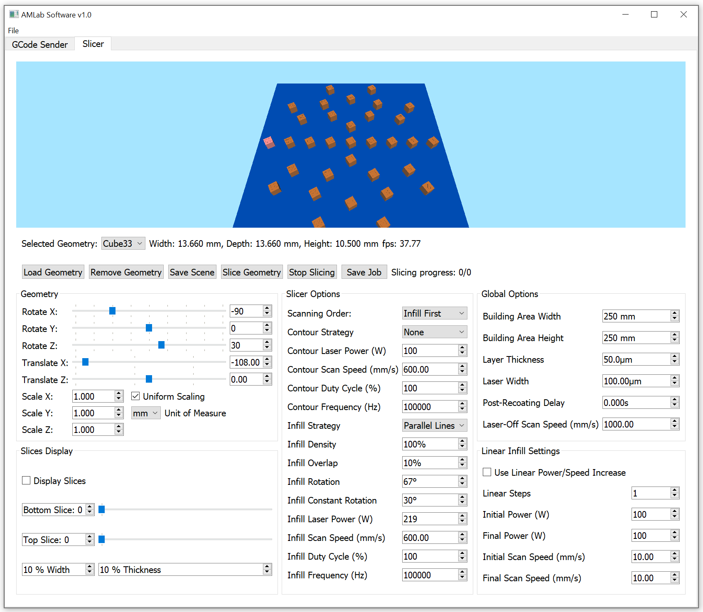
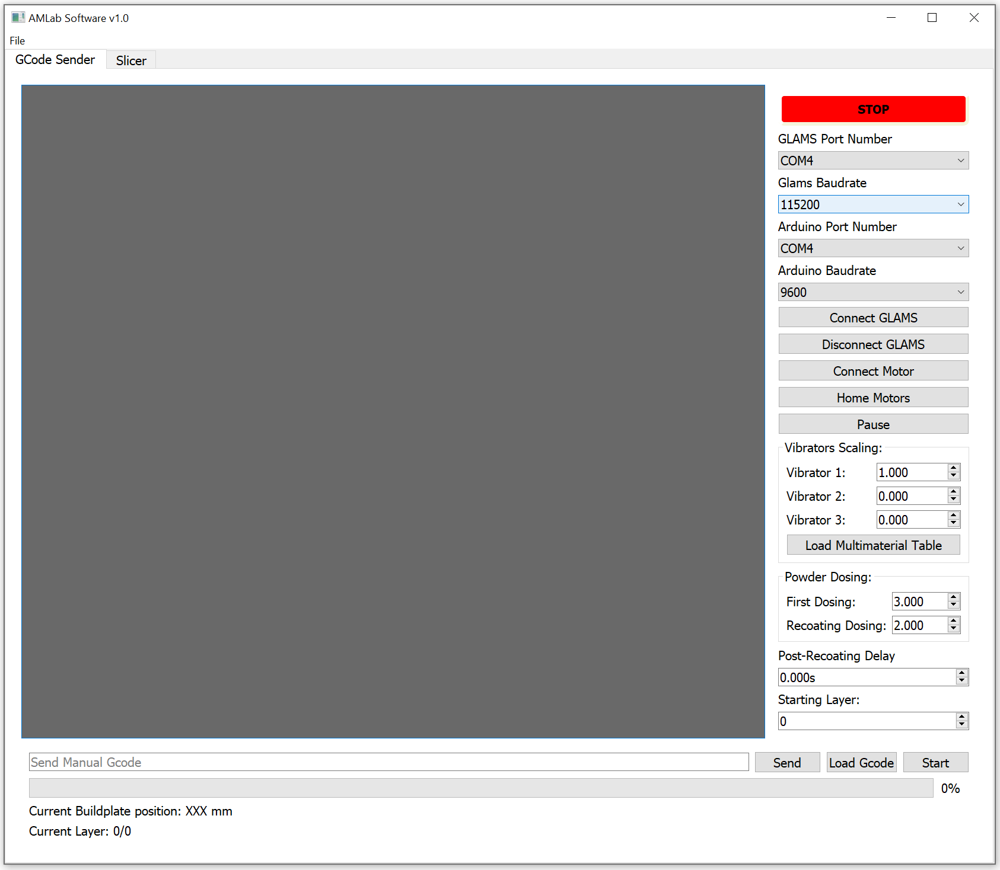

<h1 align="center">The DTU Open Additive Initiative, Laser-Based Powder Bed Fusion Repo</h1>

# OpenAM

_Update 3rd of January 2024._

The DTU Open AM PBF repo for everything related to machine building (CAD, schematics, BOM, etc.). Everything is a work in progress and will be published as soon as sufficiently detailed documentation is produced. Some changes were made to the system, resulting in versions 1 and 2. Version 2 will be the actual release.

**Project Impetus:** The world of Laser Powder-bed Fusion (L-PBF) has been tightly held within the clutches of proprietary practices, limiting innovation and knowledge sharing. This project was born out of a desire to challenge this exclusivity by creating an open-source infrastructure for L-PBF. The aim was to democratize access to this advanced manufacturing process, stimulate innovation, and foster cross-disciplinary collaboration. Despite the complex and professional nature of L-PBF, which involves dealing with high-power lasers, explosive metal powders, and specialized equipment, the project's commitment to open-source principles remained unwavering.

**Project Results:** The project successfully designed, built, verified and validated an open-source metal L-PBF system. The resulting machine is user-friendly, fully open, and performs comparably with commercial L-PBF systems. The entire design and detailed documentation are published under the CERN-OHL-P (permissive) v2 Open Source Hardware license and are accessible for public adaptation and improvement. The project contributes to a broader understanding and accessibility of additive manufacturing technology, paving the way for future enhancements and a community-driven approach to innovation.

Find out more and contribute to the evolution of this revolutionary project on GitHub. Join us in advancing the field of additive manufacturing!

## Physical System

<h3 align="center">Front view of the system</h3>

<h3 align="center">Design concepts of the system</h3>

<h3 align="center">The formal structure of the system showing critical elements (or element clusters)</h3>

<h3 align="center">Object Process Methodology to visualize the system archietecture</h3>

### CAD
Each sub-system has its own folder with a .zip containing .step-files and technical drawings in .pdf.
The technical drawings will be a mix of drawings for manufacture and assembly instructions.

<h3 align="center">Main mechanical systems</h3>

### Electrical
The Electrical folder will contain information regarding the electrical side of things.

### BOM
The folder called Bill of Materials combine all the information, including supplier information and datasheets (if available).
Link to the airtable document is in the BOM readme.

<h3 align="center">Cost distribution</h3>

## Controller

<h3 align="center">GLAMS OPM</h3>

### PCB

### Firmware
The Firmware folder contain the code for the system controller.

## Software

### Slicer and controller communication

<h3 align="center">Slicer</h3>

<h3 align="center">gcodeSender</h3>

## Applications

<h3 align="center">Manufactured samples</h3>

/Magnus

