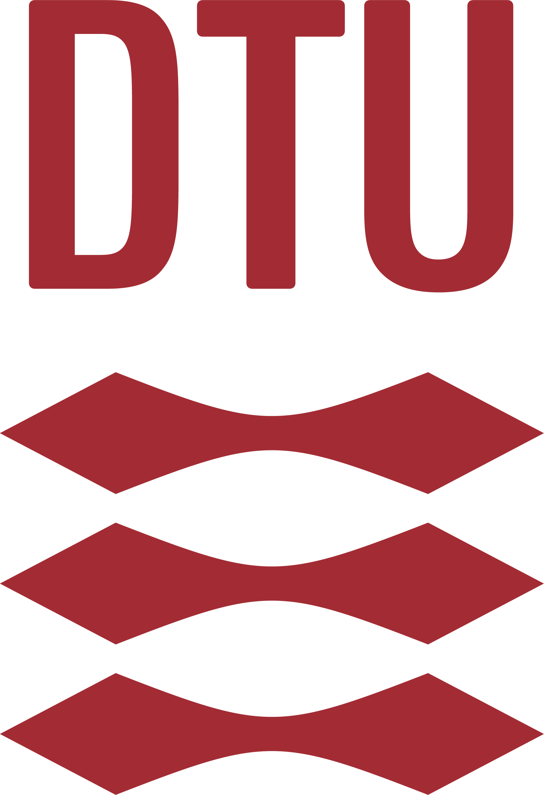

<h1 align="center">The DTU Open Additive Initiative, Laser-Based Powder Bed Fusion Repo</h1>

# OpenAM

The DTU Open AM PBF repo for source code, CAD etc. The project was undertaken across bla bla bla years and we are excellent bla bla

All files in this repo is published under the CERN-OHL-P v2 license.

## Physical System

<h3 align="center">Front view of the system</h3>

<h3 align="center">Design concepts of the system</h3>

<h3 align="center">Main mechanical systems</h3>

### CAD
Each sub-system has its own folder with a .zip containing .step-files and technical drawings in .pdf.
The technical drawings will be a mix of drawings for manufacture and assembly instructions.

### Electrical
The Electrical folder will contain information regarding the electrical side of things.

### BOM
The folder called Bill of Materials combine all the information, including supplier information and datasheets (if available).
Link to the airtable document is in the BOM readme.

## Controller

### PCB

### Firmware
The Firmware folder contain the code for the system controller.

## Software

### Slicer and controller communication

/Magnus

